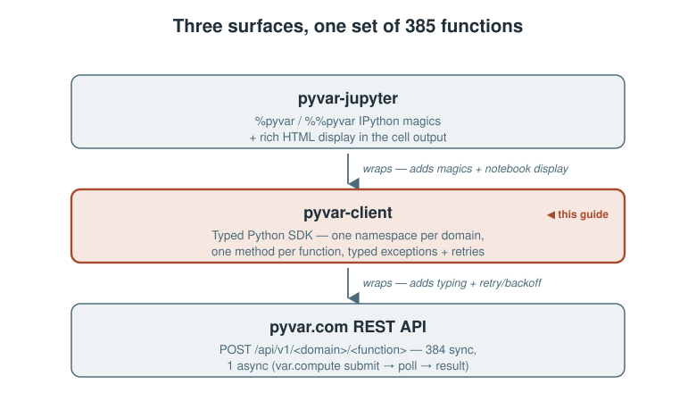
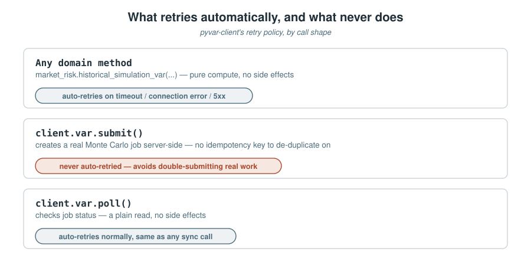

# pyvar-client: A Python SDK for 385 Risk Functions, With Ready-to-Use Examples

*A practical guide to `pyvar-client` — install, auth, your first call, the one async function in the whole API, error handling, retries, and the CLI that comes free with it.*

> **Draft status:** not yet published. Every example below runs against
> `pyvar-client`'s actual source (`pyvar-client/pyvar_client/`) and its own
> README — see **Sources** at the end. Needs review before it goes anywhere.
> Diagrams are local SVGs (`./assets/diagrams/`) for repo/GitHub preview —
> re-upload them through Medium's own editor at publish time; relative
> paths don't carry over.

---

pyvar.com exposes 385 risk functions — VaR, credit scoring, derivatives pricing, liquidity ratios, and more — as a REST API. `pyvar-client` is the official Python SDK: one typed client, one namespace per domain, no HTTP client code to write by hand. This is a hands-on guide to actually using it, not a feature list.



## Install and authenticate

```bash
pip install pyvar-client
```

Every call needs a bearer token — get a free-tier API key at [pyvar.com](https://www.pyvar.com#get-api-key) (no password, no credit card). The client has no registration flow of its own; that's a one-time human step via email verification.

```python
from pyvar_client import Client

client = Client(api_key="eyJ...")
```

Or as a context manager, which closes the underlying connection pool on exit:

```python
with Client(api_key="eyJ...") as client:
    ...
```

## Your first call

Every domain hangs off `client` as its own namespace — `client.market_risk`, `client.credit_risk`, `client.derivatives`, and five more. One method per function, fully typed, so your editor's autocomplete already knows every parameter:

```python
result = client.market_risk.historical_simulation_var(
    returns=[0.01, -0.02, 0.015, ...],  # historical daily log-returns
    portfolio_value=1_000_000,
    confidence_level=0.99,
)
print(result["var_pct"], result["var_abs"])
```

That's the whole pattern — 384 of the 385 functions work exactly this way: call it, get a dict back.

## A second, ready-to-use example: credit scoring

Not every function is about VaR. `client.credit_risk.altman_z_score_credit_scoring` runs the Altman (1968) Z-score for a public manufacturer — plain scalar inputs, no historical series required:

```python
result = client.credit_risk.altman_z_score_credit_scoring(
    working_capital=1_200_000,
    retained_earnings=3_400_000,
    ebit=900_000,
    market_value_equity=8_000_000,
    sales=5_500_000,
    total_assets=10_000_000,
    total_liabilities=4_000_000,
)
print(result)  # Z-score + zone: safe (>2.99) / grey (1.81-2.99) / distress (<1.81)
```

Every one of the 385 functions follows this same shape — the parameter names and docstrings come straight from the same OpenAPI schema the REST API itself publishes, so there's nothing here that isn't equally discoverable by reading `portal/functions.json` or the live `/docs` endpoint.

## The one async function: Monte Carlo VaR

`POST /var/compute` is the single exception to "call it, get a result." It's a real Monte Carlo job dispatched to pyvar's Celery/SQS worker fleet, so it returns a `task_id` immediately, not a finished answer. `client.var` wraps the submit/poll cycle:

```python
# Blocks: submits, polls until done, returns the finished result.
result = client.var.compute(
    portfolio_value=1_000_000,
    returns=[...],
    n_simulations=100_000,
)
```

Or drive it yourself, if you'd rather not block:

```python
task_id = client.var.submit(portfolio_value=1_000_000, returns=[...])
status = client.var.poll(task_id)  # checks once, no blocking
```

One asymmetry worth knowing: above a simulation-count threshold, the API offloads the full loss distribution to S3 and returns a `presigned_url` instead of the inline `loss_dist`. `compute()` returns exactly what the API returned either way — fetching the presigned URL yourself is a plain `httpx.get()` if you need the raw distribution, not something the client silently does on your behalf.

## Errors you can actually branch on

Every non-2xx response raises a typed exception, not a generic HTTP error:

| Exception | Status | What it carries |
|---|---|---|
| `PyvarAuthError` | 401 | Token missing, invalid, or expired |
| `PyvarValidationError` | 422 | `.detail` — field-level validation errors |
| `PyvarRateLimitError` | 429 | `.retry_after` (seconds), from the response header |
| `PyvarComputeError` | — | A VaR job reached `status="failure"` server-side; `.task_id`, `.detail` |
| `PyvarTimeoutError` | — | A VaR job didn't finish in time; `.task_id` — poll again, it may still complete |
| `PyvarError` | any other 4xx/5xx | Base class — catch this if you just want "did it fail" |

```python
from pyvar_client import PyvarRateLimitError, PyvarValidationError

try:
    client.market_risk.historical_simulation_var(returns=[...], portfolio_value=1_000_000)
except PyvarValidationError as e:
    print(e.detail)
except PyvarRateLimitError as e:
    print(f"retry after {e.retry_after}s")
```

## Retries, and the one call that's never auto-retried

Every synchronous domain function is idempotent — pure compute, no side effects — so connection errors, timeouts, and 5xx responses retry automatically with exponential backoff. `client.var.submit()` is the deliberate exception: it's never auto-retried, because retrying a job submission blindly risks double-submitting real compute work against an API with no idempotency-key mechanism to de-duplicate on. `client.var.poll()` is a read, so it retries normally.



## The CLI that comes with it

`pip install pyvar-client` also installs a `pyvar` command — stdlib `argparse` only, no extra install step:

```bash
export PYVAR_API_KEY="eyJ..."

pyvar market_risk historical_simulation_var --params-json \
    '{"returns": [0.01, -0.02, 0.015], "portfolio_value": 1000000}'
```

Call any function with no parameters and it prints the docstring and signature instead of making a doomed request:

```bash
$ pyvar market_risk historical_simulation_var --api-key "$PYVAR_API_KEY"
historical_simulation_var(*, returns: list[float] | list[list[float]], portfolio_value: float, ...) -> dict[str, Any]

Non-parametric Historical Simulation VaR...
```

Browse what's available with no credentials at all:

```bash
pyvar list-domains
pyvar list-functions --domain market_risk
```

Exit codes mirror the exception table above (`2` = auth, `3` = validation, `4` = rate limit, `5` = compute/timeout) — enough to branch on in a shell script without parsing stderr text.

## Why 385 methods don't drift from the API

Hand-maintaining 385 typed methods against a REST API that keeps changing is exactly how a client silently falls out of sync with what it wraps. `pyvar_client/_generated/` is produced by `codegen/generate.py`, which reads the live OpenAPI schema directly from `main.create_app().openapi()` — not a hand-copied list. Regenerating after any API change is one command, and CI fails the build if committed output ever drifts from what regenerating actually produces — the same discipline the main pyvar repo uses for its own plugin and portal catalogues.

The one hand-written exception is `client.var` itself — because submit/poll/compute is a genuinely different call shape from every other function's request/response pattern, not a mechanical variation the generator could produce safely.

## Try it

```bash
pip install pyvar-client
```

```python
from pyvar_client import Client

with Client(api_key="your-free-tier-key") as client:
    result = client.market_risk.historical_simulation_var(
        returns=[0.01, -0.02, 0.015, 0.008, -0.011],
        portfolio_value=1_000_000,
    )
    print(result)
```

---

## Sources

- `pyvar-client/README.md` (this repo) — install, quick start, errors, retries, CLI, codegen — the primary source for this article, quoted and lightly adapted throughout.
- `pyvar-client/pyvar_client/_client.py`, `_var.py` (this repo) — `Client.__init__`, `VarNamespace.submit`/`poll`/`compute`, quoted directly.
- `pyvar-client/pyvar_client/_generated/credit_risk.py` (this repo) — `altman_z_score_credit_scoring`'s real signature and docstring, the source for the second worked example.
- `pyvar-client/codegen/generate.py` (this repo) — the OpenAPI-schema-driven code generator described above.
- [PyPI: pyvar-client](https://pypi.org/project/pyvar-client/) — the published package this article's install instructions target.
