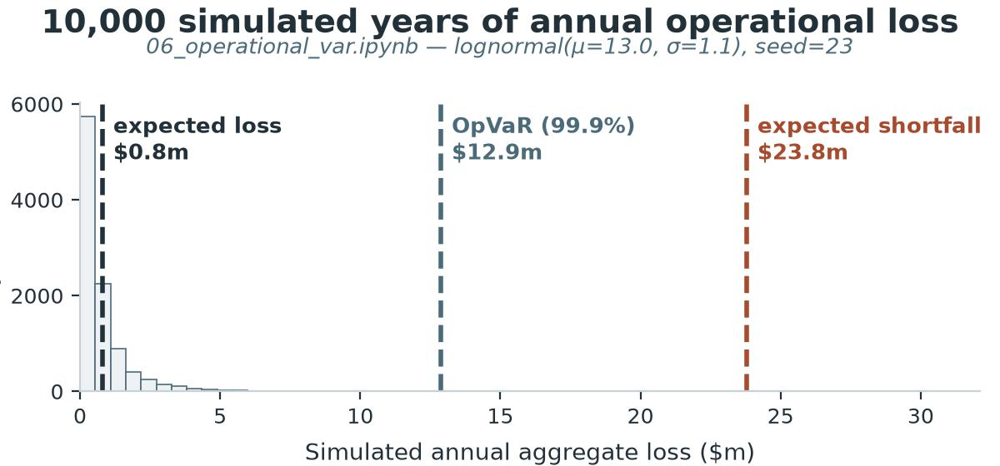
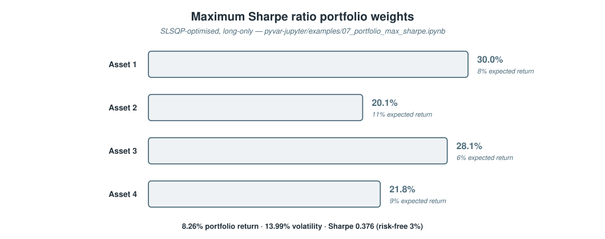

# Nine Worked Examples, Eight Risk Domains: pyvar's Jupyter Notebooks in Practice

*A companion to the pyvar-jupyter guide: real code, real inputs, and real computed results — tables and charts included — for every risk domain pyvar covers, not just the two the original three examples happened to touch.*

> **Draft status:** not yet published. Every number, table, and chart below
> was produced by actually running the corresponding `engine/` function
> locally with the exact inputs shown — none of it is estimated or
> reconstructed from memory. See **Sources** at the end. Needs review
> before it goes anywhere.
> Diagrams are local JPGs/SVGs (`./assets/diagrams/`, `./assets/tables/`)
> for repo/GitHub preview — re-upload them through Medium's own editor at
> publish time; relative paths don't carry over.

---

`pyvar-jupyter/examples/` started with three worked notebooks — Monte Carlo VaR, a Basel backtest, and an American option — and they were good notebooks, but they only actually touched two of pyvar's eight risk domains. Six more now exist, one per remaining domain: Credit Risk, Liquidity Risk, Operational Risk, Portfolio Analytics, Regulatory, and ALM. This piece walks through what each one actually computes, with the real output rendered as a table or a chart rather than left as a wall of numbers in a code cell.

## Credit Risk, Liquidity Risk, and Regulatory: three sensitivity tables in one

These three domains share a shape: a small, closed-form calculation (`EL = PD × LGD × EAD`, `LCR = HQLA / net outflows`, `CET1 ratio = capital / RWA`) where the interesting part isn't any single number, it's how the number moves as one input does. So instead of one code cell and one result each, here's each function run three times against a real, plausible input sweep:


Two things worth noticing in that table rather than skipping past it. First, the Liquidity Risk row where inflows are $0 comes back `LCR = 80.0% — NOT compliant` — `liquidity_coverage_ratio_lcr` doesn't just compute a ratio, it tells you plainly when the ratio fails the 100% Basel III minimum, and this sweep was chosen specifically to hit that boundary rather than stay safely above it the whole way. Second, `credit_risk.expected_loss_el_computation` is linear in each input by construction (`EL = PD × LGD × EAD`), so PD going from 1% to 5% — a 5x move — takes EL from $22,500 to $112,500, also exactly 5x: a useful sanity check that this function behaves exactly as its own docstring says, not a coincidence.

```python
result = %pyvar credit_risk.expected_loss_el_computation pd=0.02 lgd=0.45 ead=5000000
result  # {'el': 45000.0, 'el_rate': 0.009, ...}
```

## Operational Risk: what a 10,000-year loss simulation actually looks like

`operational_risk.operational_var_opvar` takes a sample of simulated (or historical) annual aggregate losses and reads off the loss quantile at a given confidence level — the generic reader function sitting downstream of pyvar's LDA/compound-loss Monte Carlo. The worked example draws 10,000 simulated years from a lognormal distribution (a fixed seed, so the histogram below is exactly reproducible) and asks for the 99.9% quantile, the Basel AMA standard:



The shape of that histogram is the point as much as the three numbers are: almost every simulated year lands under $2m, and the $12.9m OpVaR line sits well out in a tail that's occupied by only 0.1% of simulated years — which is exactly what a 99.9%-confidence tail statistic is supposed to look like against a realistic loss distribution, not a symmetric bell curve. `expected_shortfall ($23.8m) ≥ opvar ($12.9m) ≥ expected_loss ($0.8m)` holds here by construction, the same tail-ordering guarantee `market_risk`'s ES/VaR pair gives, just applied to losses instead of P&L.

## Portfolio Analytics: where SLSQP actually puts the weight

`portfolio.maximum_sharpe_ratio_portfolio` optimises long-only weights across four assets to maximise the annualised Sharpe ratio — a real constrained optimisation (SciPy's SLSQP), not a closed-form formula, so `success: true` in the result is worth checking, not assuming:



The one non-obvious result here: Asset 2 carries the highest expected return (11%) of the four, and the optimiser still gives it the *smallest* allocation (20.1%). That's not a bug — Asset 2 also carries the highest standalone variance in the covariance matrix (0.09, versus 0.04/0.0225/0.0625 for the others), so the optimiser is trading some of that extra expected return away for the diversification benefit the lower-correlation, lower-variance assets provide. A pure return-ranked allocation would have gotten this wrong; a real mean-variance optimiser doesn't.

## ALM: which of the six IRRBB shocks actually hurts

`alm.eve_sensitivity_analysis` runs a net cash-flow ladder through all six of BCBS d368's prescribed interest-rate shock scenarios and reports ΔEVE for each, plus the worst case — the actual supervisory outlier metric, not a single stress test:


`parallel_up` is the worst case for this particular cash-flow ladder — a −$4.96m hit against a $61.45m base EVE — but that's a property of *this* ladder's shape (net cash flows skew toward the shorter end of the six tenor buckets used here), not a general rule. A book with net cash flows concentrated further out on the curve would see `parallel_down` or `steepener` bind instead. That's the actual argument for running all six shocks rather than assuming parallel risk is always the one that matters: this function makes it possible to check, rather than assume.

---

## All nine, side by side

![All nine worked examples, one per risk domain — a table listing Market Risk (var.compute and market_risk.traffic_light_backtesting), Derivatives (derivatives.american_option_lsm), Credit Risk (credit_risk.expected_loss_el_computation), Liquidity Risk (liquidity_risk.liquidity_coverage_ratio_lcr), Operational Risk (operational_risk.operational_var_opvar), Portfolio Analytics (portfolio.maximum_sharpe_ratio_portfolio), Regulatory (regulatory.basel_iii_cet1_ratio), and ALM (alm.eve_sensitivity_analysis), each with its real computed result](./assets/tables/domain-examples-summary-table.svg)

Every row in that table is a real function call, a real input, and a real output — reproducible today from the exact notebooks in `pyvar-jupyter/examples/`, not summarised from a demo that was run once and not kept.

## Try it

```bash
pip install pyvar-jupyter
jupyter notebook pyvar-jupyter/examples/04_credit_risk_expected_loss.ipynb
```

```python
%load_ext pyvar_jupyter
%pyvar_key your-free-tier-key

%pyvar credit_risk.expected_loss_el_computation pd=0.02 lgd=0.45 ead=5000000
```

---

## Sources

- [`pyvar-jupyter/examples/04_credit_risk_expected_loss.ipynb`](https://github.com/fibtecltd/pyvar/blob/master/pyvar-jupyter/examples/04_credit_risk_expected_loss.ipynb) through [`09_alm_eve_sensitivity.ipynb`](https://github.com/fibtecltd/pyvar/blob/master/pyvar-jupyter/examples/09_alm_eve_sensitivity.ipynb) — the six notebooks this article is drawn from directly.
- [`engine/credit_pd_lgd.py`](https://github.com/fibtecltd/pyvar/blob/master/engine/credit_pd_lgd.py), [`liquidity_ratios.py`](https://github.com/fibtecltd/pyvar/blob/master/engine/liquidity_ratios.py), [`oprisk_lda.py`](https://github.com/fibtecltd/pyvar/blob/master/engine/oprisk_lda.py), [`portfolio_optimisation.py`](https://github.com/fibtecltd/pyvar/blob/master/engine/portfolio_optimisation.py), [`reg_basel_capital.py`](https://github.com/fibtecltd/pyvar/blob/master/engine/reg_basel_capital.py), [`alm_nii_eve.py`](https://github.com/fibtecltd/pyvar/blob/master/engine/alm_nii_eve.py) — the real engine functions each notebook calls.
- [`pyvar-jupyter/README.md`](https://github.com/fibtecltd/pyvar/blob/master/pyvar-jupyter/README.md) — the full list of all nine notebooks.
- [`docs/publications/pyvar-jupyter-guide-medium-article.md`](https://github.com/fibtecltd/pyvar/blob/master/docs/publications/pyvar-jupyter-guide-medium-article.md) — the general `%pyvar`/`%%pyvar` magics guide this piece is a companion to, covering install/setup and the first three examples in more depth.
- [`docs/proposals/pyvar-additional-use-cases-and-audiences.md`](https://github.com/fibtecltd/pyvar/blob/master/docs/proposals/pyvar-additional-use-cases-and-audiences.md) — who these six additional domains actually serve (fund managers, insurers, investment firms, and others beyond a bank's own risk desk).
