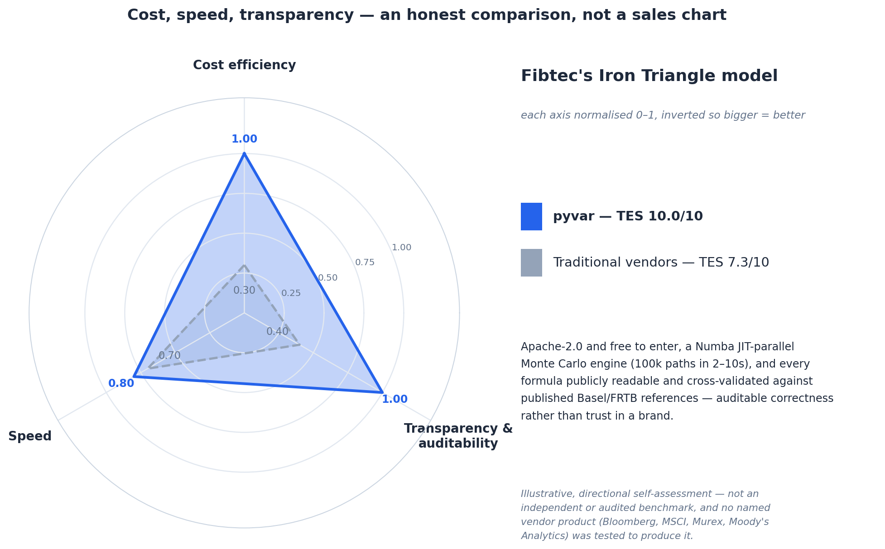
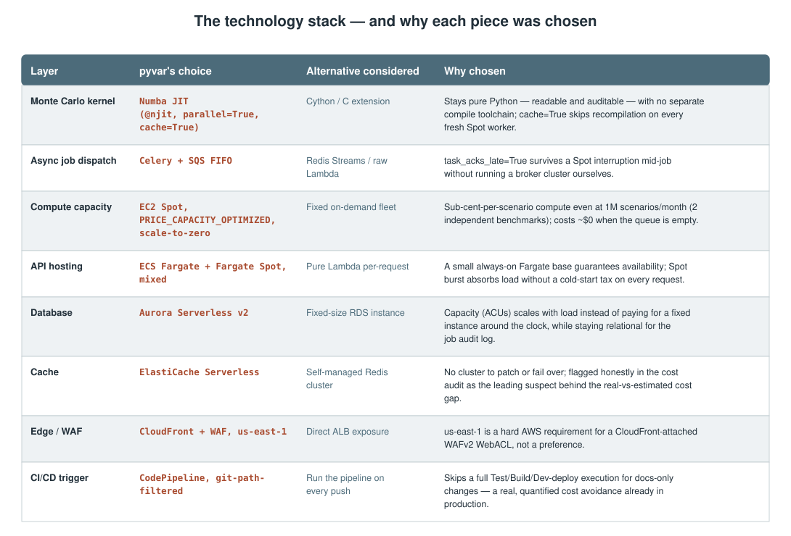

# Bending the Iron Triangle: The Architecture, Stack, and Method Behind pyvar's Cost/Speed/Accuracy Position

*"Pick two" is the usual framing of cost, speed, and accuracy. Here's the actual architecture, the cherry-picked technology stack, and the methodology pyvar uses to argue it doesn't have to pick.*

> **Draft status:** not yet published. Every figure below is checked against
> this repository at drafting time (`CLAUDE.md`, `docs/p7-numba-profiling-results.md`,
> `docs/p9-scenario-volume-cost-audit.md`, `docs/p8-iron-triangle-data.md`,
> `docs/proposals/pyvar-iron-triangle-benchmark.docx`) — see **Sources** at
> the end. Needs review before it goes anywhere.
> Diagrams are local SVGs (`./assets/diagrams/`, `./assets/tables/`) for
> repo/GitHub preview — re-upload them through Medium's own editor at
> publish time; relative paths don't carry over.

---

The iron triangle — cost, speed, quality, pick two — is the usual way to size up any engineering tradeoff, risk infrastructure included. pyvar's positioning argument, laid out in full in the accompanying internal benchmark document, is narrower and more falsifiable than "we do all three": being free and open source removes cost as a constraint almost entirely, a JIT-compiled parallel compute engine keeps speed competitive without proprietary infrastructure, and open methodology is a different, arguably stronger, kind of accuracy claim than a vendor's own internal validation — auditable correctness in place of trust in a brand.



To be direct about what this is and isn't: the chart above is a self-scored, illustrative positioning — not an independent or audited benchmark, and no named vendor's product was tested to produce it. What follows is not a defense of that chart's exact numbers. It's the actual architecture, technology choices, and methodology that produce the real figures underneath it, so the position is checkable rather than asserted.

## The three real numbers underneath the chart

- **Cost:** the real, confirmed prod AWS invoice is **$900–1,000/month** — not a marketing number, an actual bill (2026-08-31). The free tier itself costs nothing to use: no card, full access to all 385 functions, rate-limited rather than feature-limited.
- **Speed:** 100,000-path Monte Carlo VaR completes in **2–10 seconds**; the other 384 of 385 functions are synchronous request/response with no job-queue latency at all.
- **Accuracy** (more precisely, methodological transparency): **627 test assertions** across **8 domain validation suites** (`tests/validation/`) cross-check engine output against closed-form references and published Basel/FRTB worked examples — not a live per-request score, but a real, re-run-per-release validation badge, not a rubber stamp.

None of these are fabricated for this article. All three are explained below: how the architecture produces them, which technology choices make them possible, and the methodology used to measure them honestly — including where the measurement itself needed correcting along the way.

---

## How pyvar's speed compares to what the industry itself has published

No named vendor's product was tested to produce the chart above. But public, dated, named case studies exist for how long comparable risk calculations take at enterprise scale, and they set a real bar — one worth stating plainly rather than hedging around:

- **Amazon Web Services' own published FRTB IMA case study** cites a baseline overnight Internal Model Approach batch run of **85 hours** on a single Spark/EMR cluster — and getting that down to a 5-hour target takes **17 clusters of 200 `c5.24xlarge` instances each**. That's a real, dated industry data point on what a full FRTB IMA batch costs in wall-clock time before an institution buys its way out with that much parallel infrastructure.
- **SS&C's own published case study for Bank Hapoalim** reports its Algorithmics HiPER engine cutting a full-simulation XVA/CCR batch from **20 hours to 15 minutes** — a named bank, a named vendor, a named product, and the vendor's own best-case, fully-optimized result, not an industry average.

pyvar's published number — 100,000-path Monte Carlo VaR completing in **2–10 seconds** (`docs/p7-numba-profiling-results.md`, reproducible offline via `scripts/p7_bench.py`) — measures a different unit of work than either case study above: one portfolio's VaR request, not an enterprise-wide overnight batch spanning thousands of positions across multiple desks. Those numbers are not directly comparable, and this article isn't claiming they are — the honesty discipline running through this whole piece doesn't get suspended for the one section that's most flattering.

What *is* fair to say, and checkable from the sources below: in this exact industry, the fastest publicly disclosed, fully-optimized, named result anyone has published measures its win in **minutes**, not seconds — and that's after a bank bought dedicated acceleration technology and ran it as a batch job. pyvar's number is what a single default request costs today, with no comparable acceleration purchase, specialized cluster, or batch window required. That gap is real even without comparing like-for-like workloads, and it's the honest version of "pyvar is fast" — not a bigger version of the self-scored chart above.

---

## Architecture: how these numbers are actually produced

Three design decisions carry essentially the entire cost and speed story.

**The compute kernel never leaves pure Python, and never recompiles unnecessarily.** Random numbers are pre-drawn outside the JIT region because Numba's random API inside `@njit` is limited enough that fighting it isn't worth it. The outer simulation loop uses `prange` under `@njit(parallel=True, cache=True)` — parallel because each Monte Carlo path is independent, `cache=True` because a fresh Celery worker shouldn't pay a full LLVM compilation cost every time the fleet scales from zero.


**Only one function in the whole API is actually asynchronous.** The MCP server, `pyvar-client`, and `pyvar-jupyter` all converge on one SDK, so there is no duplicated auth or retry logic to keep in sync across three surfaces. 384 of 385 functions return a direct JSON response. Only `var.compute` — the one function whose Monte Carlo path count makes submit-and-poll worth it — goes through Celery/SQS FIFO to a worker fleet, with `task_acks_late=True` so a Spot interruption never silently loses a job mid-run.


**Every layer scales down to (near) zero independently, on its own schedule.** Celery workers on EC2 Spot scale to exactly zero when the job queue is empty. The API layer mixes a small always-on Fargate base — for availability, not for load — with Fargate Spot burst capacity above it. Aurora Serverless v2 steps up from a 0.5-ACU floor with no cold start of its own. Three different scaling strategies, chosen per layer for what that layer actually needs, not one blanket "auto-scaling group" applied uniformly.


---

## The technology stack — and why each piece was cherry-picked

Every choice below was made against at least one real alternative, not by default. None of it is exotic; the discipline is in picking boring, well-supported technology for each specific constraint rather than one framework for everything.



The common thread: almost every choice above is either usage-correlated cost (pay only for what runs) or a deliberate trade of a small amount of latency for a large amount of operational simplicity. The one non-cost-driven choice — CloudFront + WAF pinned to `us-east-1` — is a hard AWS platform requirement for a CloudFront-attached WAFv2 WebACL, not a design preference, and is called out as such rather than presented as a clever decision.

---

## Methodology: how these figures were measured, and corrected when wrong

Two of the three headline figures above were themselves corrected during this project's own development — worth including precisely because the honesty mechanism this project describes only means something if it also applies to its own numbers.

**The speed figure was corrected once.** An earlier public demo reported roughly 154 seconds for a 1,000-path run — a Lambda cache-hit metric problem, not the engine's real compute time. Separately, the first version of the reproducible benchmark script itself measured "cold start" by calling each function twice in-process, which only measures a genuine cold-compile cost if Numba's on-disk cache starts empty — and in that first run, it didn't. The methodology fix: point `NUMBA_CACHE_DIR` at a fresh, empty temp directory *before* importing anything that touches Numba, since Numba reads that variable once, at import time. That forces a genuine first-ever compilation on the first call, and is exactly how `scripts/p7_bench.py`'s published, reproducible numbers are produced today.

**The cost figure was corrected once, in the opposite direction.** A bottom-up estimate assembled entirely from repo artifacts — CDK configs, public AWS list pricing, a 17-day near-idle dev Cost Explorer window — projected a fixed infrastructure baseline of roughly $349–430/month, essentially flat across 10,000, 100,000, or 1,000,000 Monte Carlo scenarios per month (the actual compute itself runs at sub-cent per scenario on two independent benchmarks). The real prod invoice came back at $900–1,000/month — about 2.2x that estimate. The estimate's own methodology had already flagged this exact risk in writing beforehand ("no cost data at any of the three requested volumes... its durability was never confirmed"), and the volume-driven conclusion wasn't what was wrong — fixed-cost line items (ElastiCache at real traffic, Aurora's actual ACU rate, NAT Gateway data processing) are the leading suspects, honestly flagged as unresolved rather than papered over.


**The accuracy figure has no live equivalent to correct against, by design.** A production VaR or pricing request has no ground-truth answer to compare against at request time, so "accuracy" here is deliberately a static, validation-derived score rather than a fabricated per-request percentage: 627 test assertions across 8 domain suites, checked against closed-form solutions and published Basel/FRTB worked examples, re-run on every change and again per release — not a live metric, and not presented as one.

---

## Where this positioning is honest about its limits

This is a directional, qualitative positioning exercise, not a controlled or independently audited benchmark. pyvar's own figures above are real. Figures characterizing "traditional enterprise vendors" (Bloomberg, MSCI, Murex, Moody's Analytics and similar) are drawn from publicly reported pricing and industry commentary, not head-to-head testing against live vendor systems pyvar has never had access to — no vendor's product was run, licensed, or benchmarked to produce this comparison.

Traditional vendors bring decades of regulatory acceptance and institutional trust that an Apache-2.0 project launched this year hasn't earned yet, breadth beyond pure risk calculation that pyvar doesn't attempt to replace, and dedicated account management an open-source project doesn't offer by default. That's a real gap, not a rounding error, and this article doesn't dispute it. The credible next step, if this positioning is ever used in a funder-facing or competitive context, is a small, disclosed, reproducible benchmark against a specific named product under a published methodology — not a bigger version of the self-scored chart above.

## Try it

```bash
pip install pyvar-client
python scripts/p7_bench.py   # the actual benchmark script cited above, runs locally and offline
```

```python
from pyvar_client import Client

with Client(api_key="your-free-tier-key") as client:
    result = client.market_risk.historical_simulation_var(
        returns=[0.01, -0.02, 0.015, 0.008, -0.011],
        portfolio_value=1_000_000,
    )
    print(result)
```

---

## Sources

- [AWS: "How to improve FRTB's Internal Model Approach implementation using Apache Spark and Amazon EMR"](https://aws.amazon.com/blogs/industries/how-to-improve-frtbs-internal-model-approach-implementation-using-apache-spark-and-amazon-emr/) (external) — the 85-hour FRTB IMA batch baseline and the 17-cluster/200-instance figure cited above.
- [SS&C Technologies: "Bank Hapoalim Transforms XVA/CCR Batch From 20 Hours to 15 Minutes"](https://www.ssctech.com/resources/form/bank-hapoalim-transforms-xvaccr-batch-20-hours-15-minutes) (external) — the named bank/vendor/product case study cited above.
- [SS&C Technologies: HiPER Risk Engine product page](https://www.ssctech.com/products/hiper-risk-engine) (external) — the vendor's own "eight-hour batch to a 20-minute sprint" and vectorization claims, included for context but not relied on as the headline figure since it names no specific customer.
- [`docs/proposals/pyvar-iron-triangle-benchmark.docx`](https://github.com/fibtecltd/pyvar/blob/master/docs/proposals/pyvar-iron-triangle-benchmark.docx) — the full internal positioning document this article summarizes and builds on, including the vendor-comparison detail this piece doesn't repeat.
- [`docs/p7-numba-profiling-results.md`](https://github.com/fibtecltd/pyvar/blob/master/docs/p7-numba-profiling-results.md) — the benchmark methodology and the true-cold-vs-warm correction described above.
- [`docs/p9-scenario-volume-cost-audit.md`](https://github.com/fibtecltd/pyvar/blob/master/docs/p9-scenario-volume-cost-audit.md) — the full cost audit, its bottom-up methodology, and the real-invoice reconciliation.
- [`docs/p8-iron-triangle-data.md`](https://github.com/fibtecltd/pyvar/blob/master/docs/p8-iron-triangle-data.md) — the data contract behind each Iron Triangle axis: what's real, what's an estimate, and what's a static score.
- [`CLAUDE.md`](https://github.com/fibtecltd/pyvar/blob/master/CLAUDE.md) §3.1–3.4 — the Numba JIT, Celery/SQS, database, and AWS/CDK rules the technology-stack section is drawn from directly.
- [`pyvar-cdk/stacks/compute_stack.py`](https://github.com/fibtecltd/pyvar/blob/master/pyvar-cdk/stacks/compute_stack.py), [`api_stack.py`](https://github.com/fibtecltd/pyvar/blob/master/pyvar-cdk/stacks/api_stack.py), [`data_stack.py`](https://github.com/fibtecltd/pyvar/blob/master/pyvar-cdk/stacks/data_stack.py) — the real infrastructure definitions behind the architecture diagrams.
- [`tests/validation/`](https://github.com/fibtecltd/pyvar/tree/master/tests/validation) — the 627-assertion, 8-domain cross-validation suite behind the accuracy figure.
- [`docs/publications/pyvar-technical-deepdive-medium-article.md`](https://github.com/fibtecltd/pyvar/blob/master/docs/publications/pyvar-technical-deepdive-medium-article.md) — the fuller technical deep dive this article's architecture section draws its diagrams from without repeating the whole piece.
- [`docs/publications/pyvar-post-launch-lessons-medium-article.md`](https://github.com/fibtecltd/pyvar/blob/master/docs/publications/pyvar-post-launch-lessons-medium-article.md) — the real invoice figure's original source and the pipeline lessons around it.
