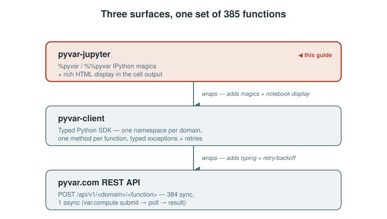

# pyvar-jupyter: Interactive Risk Analysis in a Notebook, With Three Worked Examples

*A practical guide to `%pyvar`/`%%pyvar` IPython magics — quick start, line vs. cell magic, discoverability, and three complete worked notebooks you can run today.*

> **Draft status:** not yet published. Every example below is taken
> directly from `pyvar-jupyter`'s own README and its three shipped example
> notebooks (`pyvar-jupyter/examples/*.ipynb`) — see **Sources** at the
> end. Needs review before it goes anywhere.
> Diagrams are local SVGs (`./assets/diagrams/`) for repo/GitHub preview —
> re-upload them through Medium's own editor at publish time; relative
> paths don't carry over.

---

`pyvar-jupyter` adds IPython magics and rich HTML display on top of `pyvar-client` — the notebook-ergonomics layer, not a second API client. If you already know `pyvar-client`, everything here is the same 385 functions, called with less typing.



## Install and load

```bash
pip install pyvar-jupyter
```

Installs `pyvar-client` automatically. In a notebook cell:

```python
%load_ext pyvar_jupyter
%pyvar_key eyJ...  # or export PYVAR_API_KEY before starting the kernel
```

## Your first call

```python
%pyvar market_risk.historical_simulation_var returns=[0.01,-0.02,0.015] portfolio_value=1000000
```

The result renders as a formatted HTML table in the cell output, and is also returned to `Out[]` — `result["var_abs"]` works on it directly, same as the plain `pyvar-client` dict it wraps.

## Line magic vs. cell magic

The line form (`%pyvar`) takes params as space-separated `key=value` tokens, each parsed with `ast.literal_eval` — numbers, lists, dicts, booleans, and `None` all come through as their real Python type, not strings:

```python
%pyvar var.compute returns=[0.01,-0.02,0.015] \
    portfolio_value=1000000 confidence_level=0.99 n_simulations=100000
```

Once params get large or nested — arrays of arrays, nested objects — the cell form (`%%pyvar`) takes a JSON object in the cell body instead:

```python
%%pyvar derivatives.heston_stochastic_volatility_model
{
  "spot": 100.0,
  "strike": 105.0,
  "rate": 0.02,
  "tau": 1.0,
  "v0": 0.04,
  "kappa": 2.0,
  "theta": 0.04,
  "sigma": 0.3,
  "rho": -0.7,
  "option_type": "call"
}
```

## Forgot the parameters? Just call it empty

Either form, called with no parameters, prints the function's docstring and signature instead of making a doomed API call:

```python
%pyvar market_risk.historical_simulation_var
```
```
historical_simulation_var(*, returns: 'list[float] | list[list[float]]', portfolio_value: 'float', confidence_level: 'float' = 0.99) -> 'dict[str, Any]'

Non-parametric Historical Simulation VaR.

Re-prices the portfolio under each observed historical return and reads the
empirical loss quantile — making no distributional assumption.
```

![One call, two views — both %pyvar and %%pyvar magic forms parse their params differently but dispatch to the same pyvar-client call, which renders as an HTML table and is also bound to Out[]](./assets/diagrams/jupyter-magic-dispatch.svg)

## The display helper, without magics

`pyvar_jupyter.show()` wraps any `pyvar-client` result for the same rich HTML rendering — useful in a loop or a script cell where you're calling `Client` directly:

```python
from pyvar_client import Client
import pyvar_jupyter

client = Client(api_key="eyJ...")
result = client.market_risk.historical_simulation_var(
    returns=[0.01, -0.02, 0.015], portfolio_value=1_000_000,
)
pyvar_jupyter.show(result)
```

The wrapped object still behaves like the underlying dict — `show()` only changes how it *renders*.

## Session config, without repeating yourself

```python
%pyvar_key eyJ...              # set/replace the API key for this kernel (in-memory only)
%pyvar_base_url http://localhost:8000   # point at a local/dev deployment instead of prod
```

Neither is needed if `PYVAR_API_KEY` / `PYVAR_API_BASE_URL` are already set as environment variables before the kernel starts — the same variable names `pyvar-client`'s own CLI and the `pyvar-mcp` plugin use, so one `.env` covers all three.

---

## Three worked examples, ready to run

All three ship in [`pyvar-jupyter/examples/`](https://github.com/fibtecltd/pyvar/tree/master/pyvar-jupyter/examples). Each needs only a free-tier API key.

### 1. Portfolio Monte Carlo VaR/CVaR

A synthetic, fixed-seed daily return series, run through `var.compute` — the one async function in the whole API — at 99% confidence:

```python
%load_ext pyvar_jupyter
%pyvar_key eyJ...

import random
random.seed(7)
returns = [random.gauss(0.0004, 0.012) for _ in range(500)]

result = %pyvar var.compute returns={returns} portfolio_value=1000000 confidence_level=0.99 n_simulations=100000
result["var_abs"], result["cvar_abs"]
```

The notebook then sweeps three confidence levels (95%, 97.5%, 99%) by calling `Client` directly in a loop and wrapping each result with `pyvar_jupyter.show()` — confirming the expected regulatory ordering: 99% VaR > 95% VaR, and ES ≥ VaR at every level.

### 2. Basel Traffic-Light Backtest

`market_risk.traffic_light_backtesting` — the Basel Committee's 250-trading-day VaR-breach test (green < 5 breaches, yellow 5–9, red ≥ 10) — against a synthetic return/VaR-estimate series with three deliberately forced breaches:

```python
import random
random.seed(11)
n_days = 250
daily_var_estimate = 0.025

actual_returns = [random.gauss(0.0002, 0.011) for _ in range(n_days)]
for day in (40, 120, 210):
    actual_returns[day] = -(daily_var_estimate + 0.005)

var_estimates = [daily_var_estimate] * n_days

result = %pyvar market_risk.traffic_light_backtesting actual_returns={actual_returns} var_estimates={var_estimates}
result
```

With this exact seed, the result comes out `n_breaches: 6`, `basel_zone: "yellow"` — the 3 forced breaches plus a few more from the random baseline alone, a small, honest reminder that a synthetic series doesn't give you exactly the number you engineered into it.

### 3. American Option Pricing with Greeks

`derivatives.american_option_lsm` — an American option priced via Longstaff-Schwartz Monte Carlo, with bump-and-reprice Greeks opted in via `greeks=True`:

```python
result = %pyvar derivatives.american_option_lsm spot=100.0 strike=100.0 rate=0.05 sigma=0.20 tau=1.0 \
    option_type=put greeks=True seed=41

assert result["delta"] < 0, "a put's delta should be negative"
assert result["gamma"] > 0, "gamma should be positive near the money"
print(f"price={result['price']:.4f}  delta={result['delta']:.4f}  gamma={result['gamma']:.5f}")
```

S=K=100, r=5%, σ=20%, τ=1 year is the textbook Longstaff-Schwartz reference case — the function's own docstring cites a ~6.024 European-price benchmark at this exact input set, giving a built-in sanity check on the American price this call returns (which must be ≥ the European price). The notebook closes with a put-vs-call delta comparison, confirming both come back with the expected sign and roughly symmetric magnitude near the money.

## Try it

```bash
pip install pyvar-jupyter
jupyter notebook
```

Then, in a fresh notebook:

```python
%load_ext pyvar_jupyter
%pyvar_key your-free-tier-key

%pyvar market_risk.historical_simulation_var returns=[0.01,-0.02,0.015,0.008,-0.011] portfolio_value=1000000
```

---

## Sources

- `pyvar-jupyter/README.md` (this repo) — install, quick start, magic forms, display helper, session config — the primary source for this article, quoted and lightly adapted throughout.
- `pyvar-jupyter/examples/01_portfolio_var.ipynb`, `02_basel_backtest.ipynb`, `03_derivatives_greeks.ipynb` (this repo) — the three worked examples above, code cells reproduced directly from the shipped notebooks.
- `pyvar-jupyter/pyvar_jupyter/_magics.py`, `_display.py` (this repo) — the line/cell magic dispatch and `show()` implementation these examples exercise.
- `docs/publications/pyvar-client-guide-medium-article.md` (this repo) — the companion SDK guide this piece builds on without repeating.
